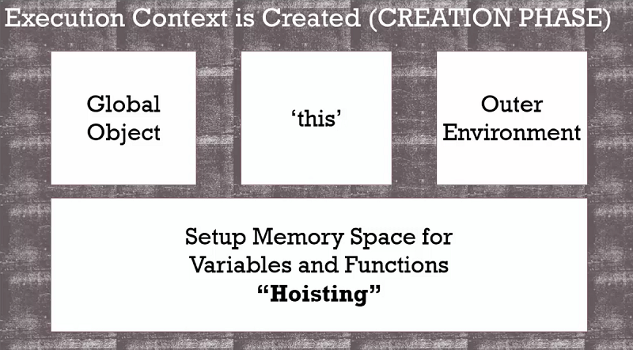

# The Execution Context - Creation and Hoisting

```javascript
var a = 'hello world!';

function b() {
  console.log('called b!');
}

b();
console.log(a);

// ===== Output =====
// called b!
// hello world!
// ==================
```

在下面的範例，一般的程式語言，呼叫 b() 可能就會出現 error，因執行到此處時 function b() 還未被宣告。但是在 Javascript 裡卻不會錯誤，因 function b() 與變數 a 在 creation phase 時已被分配記憶體，因此不會出現 error，還可執行顯示內容，稱為 Hoisting (參考 hoisting.png)
但 function 與 var 不同之處是，function 的整個程式內容會放至記憶體裡，因此裡面的內容可被完整執行; 而 var 僅有宣告，在程式未執行到 var a = 'hello world!' 的 code 之前都不會有值，因此顯示 undefined，表示 var 有宣告成功但不知道值。

```javascript
b(); 
console.log(a);

var a = 'hello world!';

function b() {
  console.log('called b!');
}

// ===== Output =====
// called b!
// undefined
// ==================
```

下面範例會出現 error，因 var a 未被宣告。
```javascript
b(); 
console.log(a);

function b() {
  console.log('called b!');
}

// ===== Output =====
// called b!
// Uncaught ReferenceError: a is not defined
// ==================
```