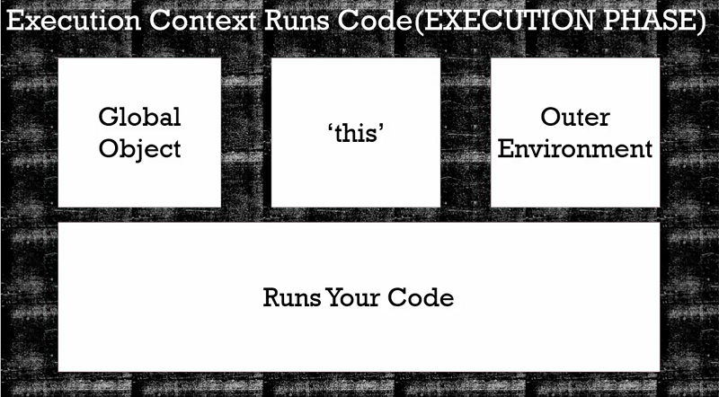

# The Execution Context - Code Execution

在前面提到的 [The Execution Context - Creation and Hoisting](../ch2-10/README.md)
當程式內容在 creation phase 已配置好記憶體，接著在 execution phase 循序執行程式內容 line by line


```javascript
function b() {
  console.log('called b!');
}

b();

console.log(a);

var a = 'hello world!';

console.log(a);

// ===== Output =====
// called b!
// undefined
// hello world!
// ==================
```