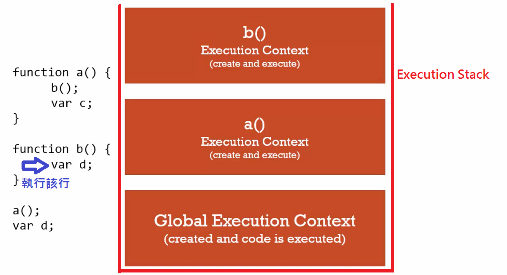
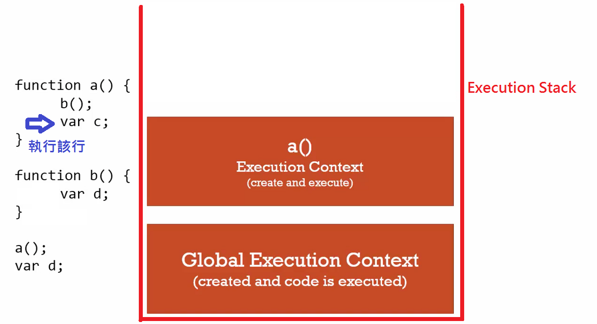
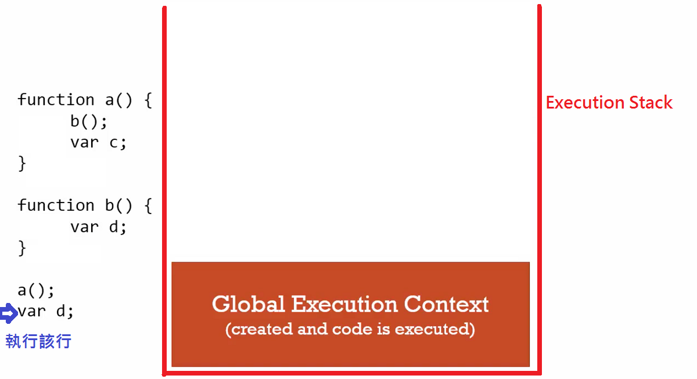

# Function Invocation and the Execution Stack

### Invocation: Running a function
- In Javascript, by using parenthesis ()
- 意旨執行一個 function

以下圖範例，當左邊程式執行起來時，會產生一個 global execution context，Javascript engine 在該 context 
的 creation phase 會配置記憶體空間給 functions 與 variables，所以 function b() 在 function a() 之下，
並不影響 function a() 裡呼叫 function b() 的行為，在 execution phase 逐行執行程式。
當呼叫 a() function 時，會產生一個新的 execution context，將該 context 丟入 execution stack，其 
context 會有自己的記憶體空間去配置 a() 裡面的 functions 與 viraibles。接著 a() 裡面又呼叫 b() function，
b() 一樣產生一個新的 execution context 丟入 execution stack，其 context 一樣會有自己的記憶體空間去配置 
functions 與 viraibles。當 b() 執行結束則 pop off，接連 a() 執行結束 pop off 直到 global execution context.

