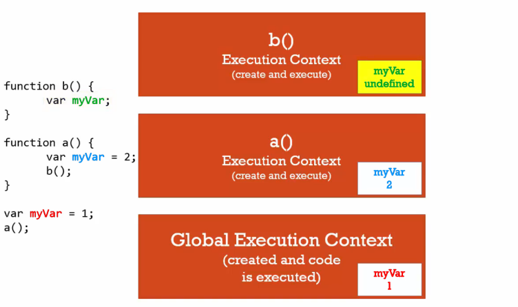

# Functions, Context, and Variable Environments

#### Variable Environment: 變數在程式碼中的位置。在不同的 execution context，變數彼此之間不會互相影響。

以下方範例為例，在 global environment, function a 及 function b 中，分別存在名為 myVar 的變數，其分別存在不同的 execution context 中，而在不同的execution context，變數彼此之間不會影響，所以雖然這三個變數都叫做 myVar，但其實是三個不同的變數。

執行左方程式碼即可發現，位於最外層的紅色 myVar 變數，存在 global execution context 中被賦予之數值為 1

而當程式執行到 a() 時，另一個屬於 function a 的 execution context 將被建立，位於 function a 中的藍色 myVar，被賦予之數值為 2，且位於 function a 中的 b()將被執行，並建立一個屬於 function b 的 execution context

位於 function b 中的綠色 myVar，未被賦予任何值，因此當程式執行至 function b 中的變數 myVar 時，綠色 myVar 之值將為 undefined

因此可看出，上方三個不同位置的變數 myVar 分別獨立存在 memory 中，雖然名稱相同，但其實是三個不同的變數，彼此之間不會相互影響。
