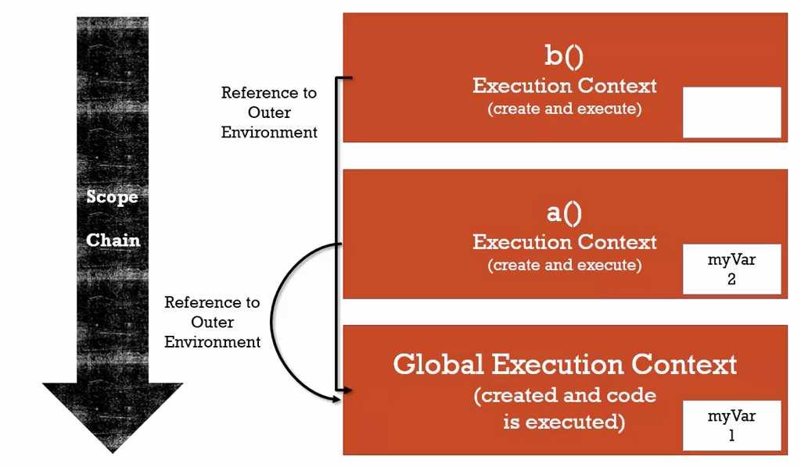

# The Scope Chain

- Scope: where can I access a variable. 可以取得變數的某個範圍
- Chain: those links of outer environment references.

##### 範例一
當呼叫 function b() 的 myVar 變數不存在自己的 execution context，其會往 outer environment 去找 myVar 變數。
**outer environment 的定義可由:**
- function b() 與 var myVar = 1 都屬於 global object (global execution context)，因此 global execution context 為 function b() 的 outer environment reference.
- 或者可說 function b() 在配置記憶體的時間點是在 global execution creation phase，因此 global execution context 為 function b() 的 outer environment reference.

```javascript
function b() {
    console.log(myVar);
}

function a() {
    var myVar = 2;
    b();
}

var myVar = 1;
a();

// ===== Output =====
// 1
// ==================
```



##### 範例二
此範例 function b() 的 outer environment reference 為 a() execution context，而 a() 的 outer environment reference 又為 global execution context. 因此 function b() 會先找 a() 裡的變數 myVar，若 a() 不存在該變數，則往 global execution context 尋找變數 myVar
```javascript
function a() {
    function b() {
        console.log(myVar);
    }
    var myVar = 2;
    b();
}

var myVar = 1;
a();

// ===== Output =====
// 2
// ==================
```

```javascript
function a() {
    function b() {
        console.log(myVar);
    }
    b();
}

var myVar = 1;
a();

// ===== Output =====
// 1
// ==================
```

