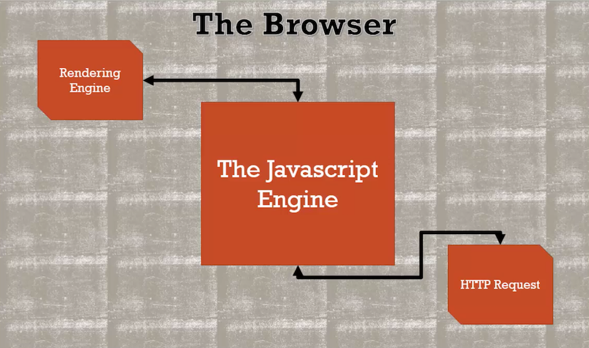
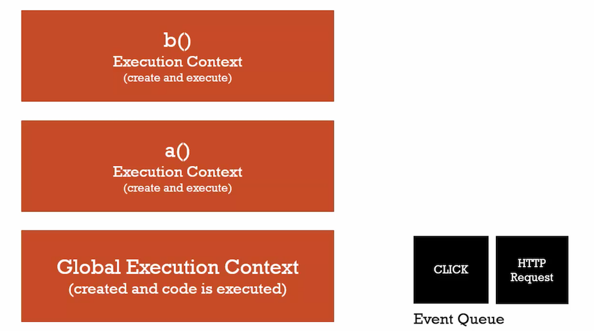

# What About Asynchronous Callbacks?

### Asynchronous: More than one at a time
- Jvascript Engine 本身是 synchronous, 在 browser 底下涵蓋 Jvascript Engine、Rendering Engine
與 HTTP Request 的行為則是 asynchronous.

- Jvascript Engine 包含了 Execution Context Stack 與 Event Queue Stack，當執行完所有的 
Execution Context Stack 後開始執行 Event Queue Stack。Browser 本身透過 asynchronous 方式
堆疊 Event Queue，但 Javascript 本身依然是 synchronous (line by line).


### 範例
- 在程式執行 function waitThreeSeconds() 時觸發 click event，可以得知當 Execution Context Stack
執行完後，才會執行 Event Queue

```javascript
// long running function
function waitThreeSeconds() {
    var ms = 3000 + new Date().getTime();
    while (new Date() < ms){}
    console.log('finished function');
}

function clickHandler() {
    console.log('click event!');   
}

// listen for the click event
document.addEventListener('click', clickHandler);


waitThreeSeconds();
console.log('finished execution');

// ===== Output =====
// finished function
// finished execution
// click event!
// ==================
```