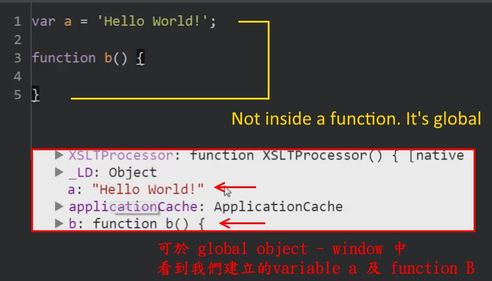

# The Global Environment and The Global Object

  

 - 在程式開始執行的過程中，JavaScript engine 最先執行 Global execution context， 同時主動創建 global object (window) 與 變數 this

 - 若執行一個空的內容 ( 如範例最初狀態 )，透過瀏覽器的 DevConsloe，鍵入 this，可瀏覽 this 這個變數內容。而這個 this 是 JavaScript engine 幫我們建立的，即為「目前瀏覽器的視窗」。另外，也有個名為 window 的 object，內容與 this 是相同的。所以 window object，也是「目前瀏覽器的視窗」。
 
 但如果使用 node.js 執行 javascript，則 global object 所代表的就不再是 window object
 ( if you are using node.js your running javascript on the server, it won't be the window object there's a different global object. )

- 每個瀏覽器分頁都有獨立的 execution context，因此各分頁的 global object 都是獨立的

- 在 global level 中，this 這個變數與 global object 是相同的 (This, refers to global window)，也可透過 window 取得 global object

### Global

- not inside the function

- 可於整個網頁範圍內調用
 

